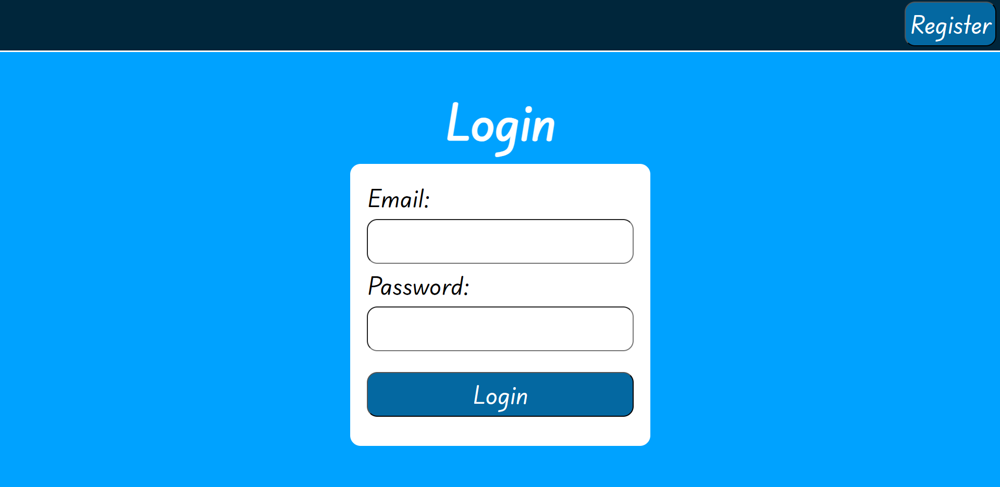
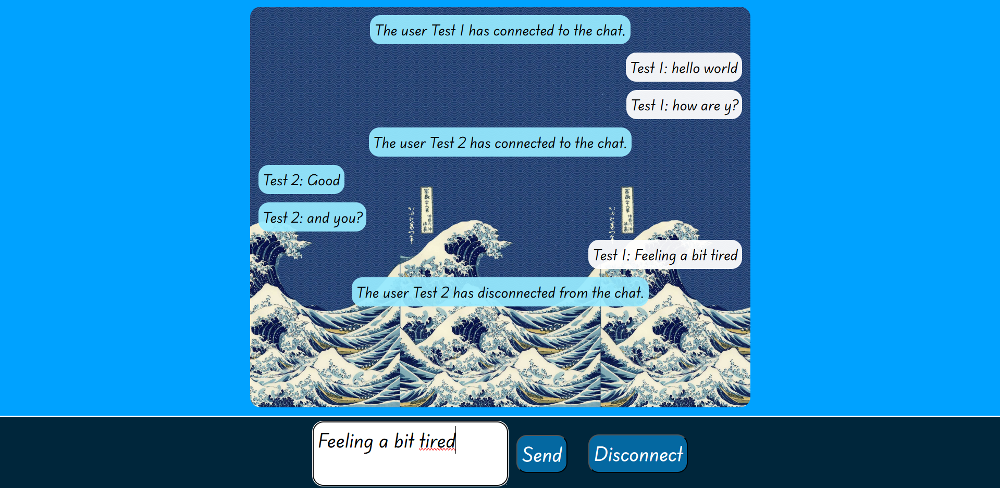

# Chat-Web-Application

An application capable of connecting multiple users to a shared chat through the use of `Websockets`.
## Deployment

To deploy this project first install [git](https://git-scm.com/) and [Docker](https://www.docker.com/), then run the command git clone inside a folder of your choosing:

```bash
git clone https://github.com/AndreaVitti/Full-Stack-Chat-App.git
```

Open the cloned repo and find the folder containing the file **compose.yaml**: there open your terminal and run the following command:

```bash
docker-compose up --build -d
```
This will build the container for the application, then just paste this url in your browser to start using the app: http://localhost:4202


## Functionalities

This application features the following:

- login/register users
- JWT token for security (access + refresh)
- the ability to create a shared chat
- the ability to let multiple users connect to a single chat
- a database storing all the messages of the various users

## How to use it

To start register a user, this will redirect you to the login page where you will need to insert the personal data you just registered. 



To send a message simply type it in a the apposite text area and click the send button.  
To disconnect simply click the button label as such (all users will be notified of the connect/disconnect of the others).




## Testing

To fully test the application you can open two separate browser windows and log in each one with a different user and start sending message to test it.
## Environment Variables

To run this project, you will need to add the following environment variables to your .env file

- `POSTGRES_USER` (by default **user**): is the username of the database  

- `POSTGRES_PASSWORD` (by default **123456789**): is the password of the database 

- `SECRET` (by default **e02a2495cbf7b...**): **IMPORTANT!** although the application will work with this key (that is used to generated the security tokens) it's highly recommended to change it with another `256bit` key for security reasons  

- `EXPIRE` (by default **1 hour**): set duration of the access token in millis

Change them as you see fit.
## Technologies Stack
**Database:** Postgres Sql

**Backend:** Spring, Spring Boot

**FrontEnd:** Angular, CSS ,Html 

**Deployment:** Docker

